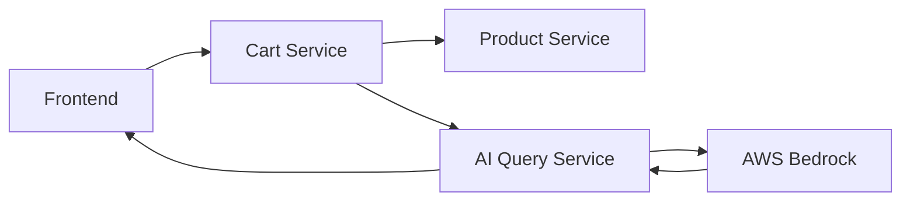

# Spring Boot Cart Service

A production-ready, stateful microservice built with Spring Boot that provides shopping cart functionality with persistent SQLite storage. This service integrates with AI-powered query services and demonstrates enterprise-grade containerization, Kubernetes deployment, and CI/CD best practices.

## 🛒 Service Architecture & AI Integration

### Core Functionality
This cart service operates as part of a larger AI-powered e-commerce ecosystem:
- **Stateful Shopping Cart**: Persistent storage with SQLite database
- **REST API**: Standard CRUD operations for cart management
- **Microservice Architecture**: Designed for service mesh communication
- **AI Integration Ready**: Prepared for intelligent recommendations and cart optimization

### AI Ecosystem Integration
While this service focuses on cart functionality, it's designed to integrate with AI services:



### AI-Ready Features
- **Cart Analytics**: Structured data for AI consumption
- **Product Integration**: Seamless communication with AI-powered product recommendations
- **Event-Driven Architecture**: Ready for real-time AI processing
- **Data Persistence**: Historical cart data for ML model training

## 🐳 Docker Best Practices Implementation

Our multi-stage Dockerfile showcases production-ready containerization:

### Multi-Stage Build Architecture
```dockerfile
# Stage 1: Build with Maven
FROM maven:3.8.5-openjdk-17 AS build
WORKDIR /app
COPY pom.xml .                    # Layer caching optimization
RUN mvn dependency:go-offline     # Cache dependencies separately
COPY src ./src
RUN mvn clean package -DskipTests

# Stage 2: Lightweight runtime
FROM eclipse-temurin:17-jre-focal
WORKDIR /app
RUN groupadd --system spring && useradd --system --gid spring spring
USER spring                      # Non-root execution
COPY --from=build /app/target/cart-0.0.1-SNAPSHOT.jar app.jar
```

### Security Best Practices
- **Minimal Base Image**: Using `eclipse-temurin:17-jre-focal` for smaller attack surface
- **Non-Root User**: Creates and runs as `spring` user (UID/GID isolation)
- **Layer Optimization**: Dependencies cached separately for faster rebuilds
- **No Secrets in Image**: All configuration externalized to environment variables

### Build Optimization Strategies
- **Dependency Caching**: `mvn dependency:go-offline` leverages Docker layer caching
- **Multi-Stage Reduction**: Build tools eliminated from final image
- **Minimal JRE**: Runtime-only image without development dependencies
- **Efficient Layering**: Source code changes don't invalidate dependency cache

### Production Readiness
- **Health Check Ready**: Spring Boot Actuator endpoints exposed
- **Graceful Shutdown**: JVM handles SIGTERM for clean container stops
- **Resource Efficient**: JRE-only image minimizes memory footprint
- **Configuration Flexible**: Externalized configuration via Spring profiles

## ☸️ Kubernetes Deployment Features

### Advanced Persistent Storage Management
```yaml
# Sophisticated volume handling for stateful service
volumes:
  - name: cart-storage
    persistentVolumeClaim:
      claimName: cart-db-pvc

# Init container for permission management
initContainers:
  - name: init-permissions
    image: busybox:1.32
    securityContext:
      runAsUser: 0              # Root for chown operation
    command: ['sh', '-c', 'chown -R 1000:1000 /app/data']
```

### Security Context Implementation
```yaml
securityContext:
  runAsUser: 1000               # Non-root user ID
  fsGroup: 1000                 # File system group for volumes
```

### Production-Grade Storage Architecture
- **PersistentVolume**: Dedicated storage allocation on cluster nodes
- **PersistentVolumeClaim**: Abstracted storage request for portability
- **Volume Mounting**: Strategic mounting at `/app/data` for SQLite database
- **Permission Management**: Init containers ensure proper file ownership

### High Availability Features
- **StatefulSet Ready**: Designed for ordered deployment and scaling
- **Data Persistence**: SQLite database survives pod restarts
- **Resource Management**: CPU/memory requests and limits for QoS
- **Health Monitoring**: Spring Boot health endpoints for liveness/readiness

### Service Mesh Integration
```yaml
apiVersion: v1
kind: Service
metadata:
  name: cart-service
spec:
  type: ClusterIP              # Internal service discovery
  selector:
    app: cart-service
  ports:
    - protocol: TCP
      port: 8080
      targetPort: 8080
```

### Enterprise Security Features
- **Network Policies**: Traffic isolation and security boundaries
- **RBAC Integration**: Service account permissions and role bindings
- **Secret Management**: Database credentials externalized
- **Pod Security Standards**: Enforced security contexts and policies

## 🚀 CI/CD Pipeline Excellence

### Multi-Stage Security Pipeline
```yaml
jobs:
  lint:     # Code quality with Checkstyle
  sca:      # Software Composition Analysis with Trivy
  sast:     # Static Application Security Testing with CodeQL
  test:     # Unit and integration testing
  dast:     # Dynamic Application Security Testing with OWASP ZAP
```

### Advanced Security Scanning

#### Static Application Security Testing (SAST)
- **CodeQL Integration**: GitHub's semantic code analysis
- **Java-Specific Rules**: Spring Boot security patterns
- **Vulnerability Detection**: SQL injection, XSS, and other OWASP Top 10
- **Security Events**: Integration with GitHub Security tab

#### Software Composition Analysis (SCA)
- **Trivy Scanner**: Comprehensive dependency vulnerability scanning
- **Severity Filtering**: Focus on CRITICAL and HIGH severity issues
- **License Compliance**: Open source license validation
- **Container Scanning**: Multi-layer image analysis

#### Dynamic Application Security Testing (DAST)
- **OWASP ZAP**: Runtime vulnerability assessment
- **Live Application Testing**: Running application security validation
- **API Security**: REST endpoint security verification
- **Penetration Testing**: Automated security probing

### GitOps Integration
```yaml
# Automated Kubernetes manifest updates
- name: Update Kubernetes Manifest
  run: |
    yq e '.spec.template.spec.containers[0].image = "${{ secrets.DOCKER_USERNAME }}/cart-service:${{ steps.image_tag.outputs.tag }}"' -i k8s/deployment.yaml

- name: Commit and Push Changes
  run: |
    git config --global user.name 'github-actions[bot]'
    git add k8s/deployment.yaml
    git commit -m "ci: Update cart-service image to ${{ steps.image_tag.outputs.tag }}"
    git push
```

### Container Registry Integration
- **Docker Hub Publishing**: Automated image builds and pushes
- **Image Tagging**: Git SHA-based versioning for traceability
- **Multi-Architecture Support**: ARM64 and AMD64 compatibility
- **Image Scanning**: Registry-integrated vulnerability assessment

### Quality Gates and Automation
- **Non-Blocking Scans**: Security scans inform but don't block deployment
- **Automated Testing**: Comprehensive test suite execution
- **Code Quality Metrics**: Checkstyle integration for coding standards
- **Dependency Management**: Automated dependency updates and security patches

## 🏗️ Spring Boot Architecture

### Domain-Driven Design
```java
@Entity
public class CartItem {
    @Id
    @GeneratedValue(strategy = GenerationType.AUTO)
    private Long id;
    private String productId;
    private String name;
    private double price;
}
```

### Repository Pattern Implementation
```java
@Repository
public interface CartItemRepository extends JpaRepository<CartItem, Long> {
    // Spring Data JPA provides CRUD operations
}
```

### Service Layer with Transaction Management
```java
@Service
public class CartService {
    @Transactional
    public void removeFromCart(Long id) {
        cartItemRepository.deleteById(id);
    }
}
```

### RESTful API Design
- **POST** `/cart/add` - Add items to cart
- **GET** `/cart` - Retrieve all cart items
- **DELETE** `/cart/remove/{id}` - Remove specific items

## 📊 Database & Persistence

### SQLite Configuration
```properties
spring.datasource.url=jdbc:sqlite:cart.db
spring.datasource.driver-class-name=org.sqlite.JDBC
spring.jpa.properties.hibernate.dialect=org.sqlite.hibernate.dialect.SQLiteDialect
spring.jpa.hibernate.ddl-auto=update
```

### Custom Hibernate Dialect
- **SQLiteDialect**: Custom implementation for SQLite compatibility
- **Identity Column Support**: Proper auto-increment handling
- **Type Mapping**: Correct SQL type definitions for SQLite

### Data Persistence Strategy
- **File-Based Storage**: SQLite database file in persistent volume
- **Transaction Management**: ACID compliance with Spring @Transactional
- **Schema Evolution**: Hibernate DDL auto-update for migrations
- **Data Integrity**: JPA validation and constraints

## 🚀 Getting Started

### Prerequisites
- Java 17+
- Maven 3.8+
- Docker & Docker Compose
- Kubernetes cluster access
- kubectl configured

### Local Development

1. **Clone and Build**
   ```bash
   git clone <repository-url>
   cd cart-service
   mvn clean install
   ```

2. **Run Locally**
   ```bash
   mvn spring-boot:run
   ```

3. **Test the API**
   ```bash
   # Add item to cart
   curl -X POST http://localhost:8080/cart/add \
     -H "Content-Type: application/json" \
     -d '{"productId":"1","name":"Laptop","price":999.99}'
   
   # Get cart items
   curl http://localhost:8080/cart
   
   # Remove item
   curl -X DELETE http://localhost:8080/cart/remove/1
   ```

### Docker Deployment

1. **Build Image**
   ```bash
   docker build -t cart-service:latest .
   ```

2. **Run Container**
   ```bash
   docker run -p 8080:8080 \
     -v $(pwd)/data:/app/data \
     cart-service:latest
   ```

### Kubernetes Deployment

1. **Create Persistent Storage**
   ```bash
   kubectl apply -f k8s/pv.yaml
   kubectl apply -f k8s/pvc.yaml
   ```

2. **Deploy Service**
   ```bash
   kubectl apply -f k8s/deployment.yaml
   kubectl apply -f k8s/service.yaml
   ```

3. **Verify Deployment**
   ```bash
   kubectl get pods -l app=cart-service
   kubectl logs -f deployment/cart-service-deployment
   ```

## 🔧 Configuration Management

### Environment Variables
| Variable | Description | Default | Required |
|----------|-------------|---------|----------|
| `SERVER_PORT` | Application port | `8080` | ❌ |
| `SPRING_DATASOURCE_URL` | Database URL | `jdbc:sqlite:/app/data/cart.db` | ❌ |
| `SPRING_PROFILES_ACTIVE` | Active Spring profile | `default` | ❌ |

### Spring Profiles
- **Development**: `application-dev.properties`
- **Production**: `application-prod.properties`
- **Testing**: `application-test.properties`

## 📈 Monitoring & Observability

### Application Metrics
```bash
# Health endpoint
curl http://localhost:8080/actuator/health

# Application info
curl http://localhost:8080/actuator/info

# Metrics endpoint
curl http://localhost:8080/actuator/metrics
```

### Kubernetes Monitoring
```bash
# Pod status
kubectl get pods -l app=cart-service

# Resource usage
kubectl top pods -l app=cart-service

# Logs
kubectl logs -f deployment/cart-service-deployment
```

### Performance Monitoring
- **JVM Metrics**: Memory, GC, and thread monitoring
- **Database Metrics**: Connection pool and query performance
- **HTTP Metrics**: Request/response times and error rates
- **Custom Metrics**: Business-specific cart operations

## 🔒 Security Implementation

### Application Security
- **Input Validation**: Spring Boot validation annotations
- **SQL Injection Prevention**: JPA parameterized queries
- **CORS Configuration**: Cross-origin request security
- **Security Headers**: Spring Security integration ready

### Container Security
- **Non-Root Execution**: Spring user with minimal privileges
- **Minimal Attack Surface**: JRE-only runtime image
- **Dependency Scanning**: Regular vulnerability assessments
- **Image Signing**: Container image integrity verification

### Kubernetes Security
- **Pod Security Context**: User ID and group restrictions
- **Network Policies**: Traffic isolation and micro-segmentation
- **RBAC**: Role-based access control for service accounts
- **Secrets Management**: Externalized sensitive configuration

## 🤝 Contributing

1. Fork the repository
2. Create a feature branch (`git checkout -b feature/cart-enhancement`)
3. Follow Spring Boot coding standards
4. Add comprehensive tests
5. Commit changes (`git commit -m 'Add cart enhancement'`)
6. Push to branch (`git push origin feature/cart-enhancement`)
7. Create a Pull Request

### Development Standards
- **Code Style**: Google Java Style Guide
- **Testing**: Unit tests with JUnit 5 and Mockito
- **Documentation**: JavaDoc for public APIs
- **Security**: OWASP secure coding practices

## 📝 API Documentation

### Cart Operations

#### Add Item to Cart
```http
POST /cart/add
Content-Type: application/json

{
    "productId": "123",
    "name": "Gaming Laptop",
    "price": 1299.99
}
```

#### Get Cart Items
```http
GET /cart

Response:
[
    {
        "id": 1,
        "productId": "123",
        "name": "Gaming Laptop",
        "price": 1299.99
    }
]
```

#### Remove Item from Cart
```http
DELETE /cart/remove/1

Response: 200 OK
```

## 📊 Performance Characteristics

### Resource Usage
- **Memory**: ~200MB baseline, scales with cart size
- **CPU**: Low utilization, scales with request volume
- **Storage**: SQLite file grows with cart data
- **Network**: Minimal bandwidth requirements

### Scalability Considerations
- **Horizontal Scaling**: StatefulSet with shared storage
- **Vertical Scaling**: Memory and CPU adjustments
- **Database Optimization**: SQLite limitations for high concurrency
- **Caching Strategy**: Redis integration for session storage

## 🆘 Troubleshooting

### Common Issues

**Q: Database file permissions error**
- Verify init container runs successfully
- Check volume mount permissions
- Ensure SQLite file is writable

**Q: Container startup fails**
- Check Java heap size settings
- Verify database file accessibility
- Review application logs for stack traces

**Q: API requests failing**
- Verify service port configuration
- Check network connectivity
- Validate request JSON format

### Debugging Commands
```bash
# Check pod events
kubectl describe pod <pod-name>

# View detailed logs
kubectl logs -f deployment/cart-service-deployment --previous

# Debug container filesystem
kubectl exec -it <pod-name> -- /bin/sh
```


---

**Built with ❤️ using Spring Boot, Docker, Kubernetes, and enterprise CI/CD practices**
